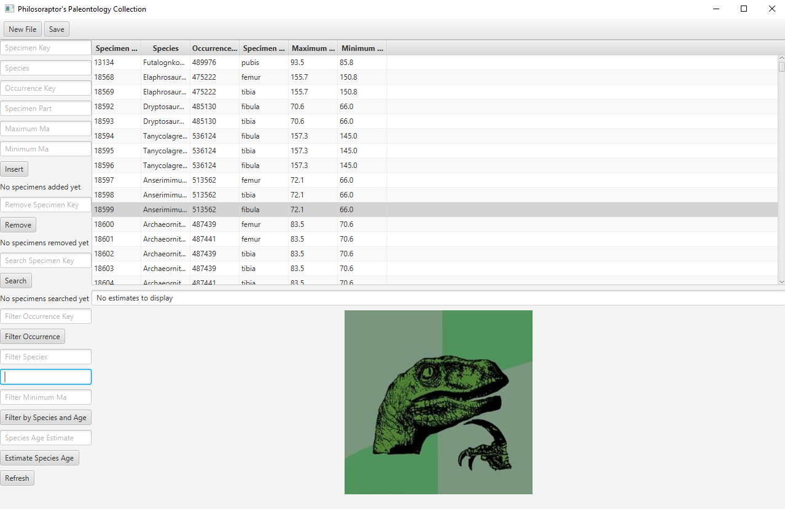

# Paleontology-Collection

Dashboard to query results from a paleontology collection. Options to insert, remove, and estimate when a species evolved and when it went extinct.

Implemented with JavaFX for GUI. Uses B-tree for backend data operations.

## Prerequisites

*Java 8
*JavaFX 14

## Vocabulary

*Specimen: individual artifact collected for scientific study, e.g. a femur or tibia
*Occurrence: animal that a specimen belongs to, e.g. Tyrannosaurus Rex #487166
*MA: millions of years ago

## Getting Started

1. Download the dinosaurs.jar file and the dinosaurs.csv from the data folder

2. Double click to open dashboard

3. Click New File on the top and select dinosaurs.csv

4. Enter or remove data. These operations require clicking the Refresh button on the bottom right corner

5. Enter a species name to estimate when it evolved and when it went extinct

6. Save to export results
